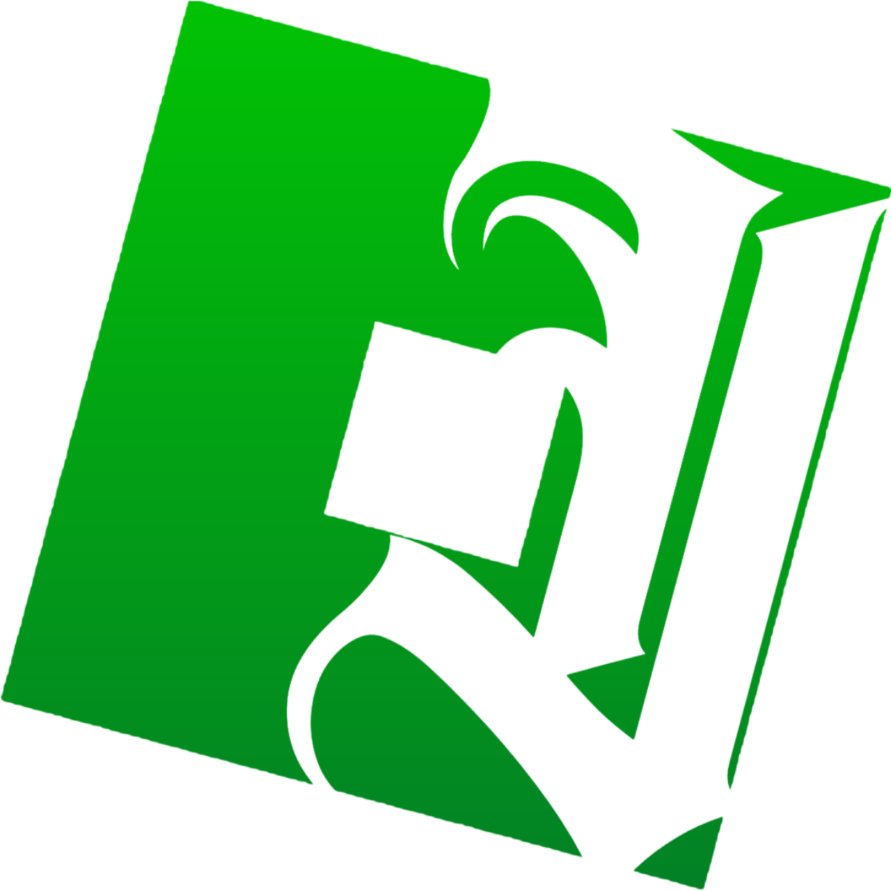
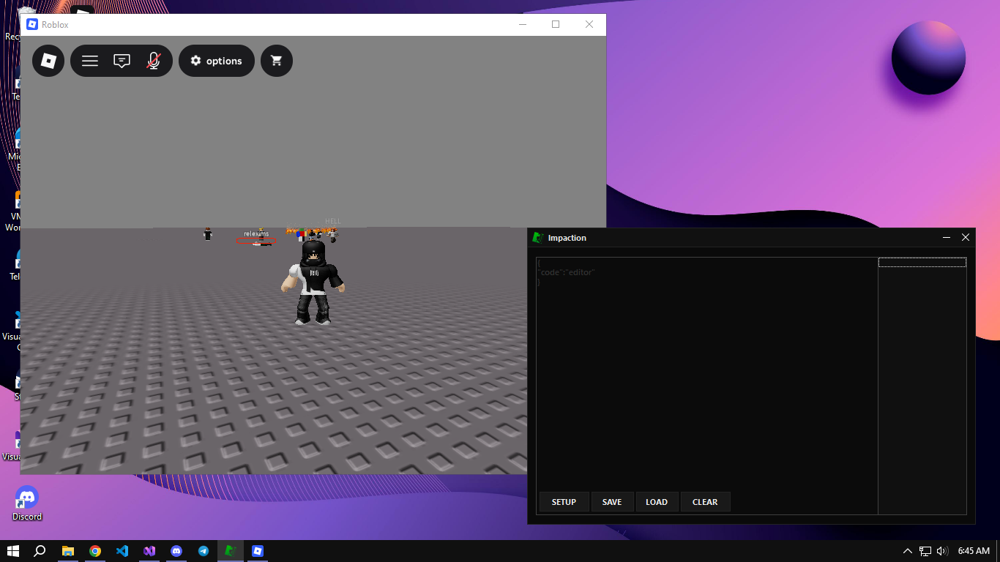

# Impaction - FFlag Editor for Roblox

<div align="center">



**A powerful, legal FFlag editor client for Roblox**

[](Impact.exe)
[](Impact.rar)
[](https://discord.com/invite/pd3HVS5QKm)

[](README.md)
[](README.md)
[](README.md)

</div>

## 📋 About

Impaction is a professional FFlag editor client for Roblox that allows you to modify and customize your game experience within Roblox's Terms of Service. Unlike exploit tools, Impaction operates completely legally and transparently.

**Main Developer:** [Yhujin](https://www.youtube.com/@yhujinism)

## ✨ Features

### ✅ 100% Legal
- Operates within Roblox's Terms of Service
- No exploits or cheating mechanisms
- Legitimate client modification only

### 🔓 Open Source
- Full transparency with public source code
- Community-driven development
- Regular updates and improvements

### 🤝 Active Community
- Get support and share configurations
- Stay updated with latest features

### 🚀 Easy to Use
- Simple installation process
- Intuitive user interface
- No technical knowledge required

## 📥 Download

### Direct Downloads:
- **[Impact.exe](Impact.exe)** - Ready-to-use executable (≈1 MB)
- **[Impact.rar](Impact.rar)** - Complete source code archive

### System Requirements:
- **OS:** Windows 10 or 11
- **Storage:** 1 MB (client) + additional space for configurations
- **Permissions:** Standard user permissions

## 🚀 Installation Guide

### Quick Installation:
1. **Download** the `Impact.exe` file
2. **Run** the executable
3. **Start** editing FFlags immediately

### From Source Code:
1. **Download** the `Impact.rar` archive
2. **Extract** the files using WinRAR or 7-Zip
3. **Compile** the source code (if needed)
4. **Run** the compiled application

## ⚙️ Setup & Configuration

### Important Setup Instructions:
Before using Impaction, follow these steps carefully:

1. **Run Impaction**: Open the Impaction client
1. **Setup Configuration**: 
   - Click the **"Setup"** button in Impaction
   - This will configure FFlag settings for your Roblox session
   - Wait for confirmation message
3. **Open Roblox**: To see the results of the config you have installed

### ⚠️ Critical Note:
**You MUST have Roblox open and running before pressing the "Setup" button.** The setup process needs to connect to your active Roblox session to properly configure FFlags. If Roblox is not running, the setup will fail.

## 🖥️ Screenshot



## 🛠️ Usage

2. **Run** Impaction client
3. **Press "Setup"** button to configure FFlags
4. Navigate through the intuitive interface
5. Modify FFlags according to your preferences
6. Save configurations for future use

## 📖 Documentation

### Basic Commands:
```bash
# Run Impaction client
./Impact.exe

# Important: Always have Roblox running before setup!
